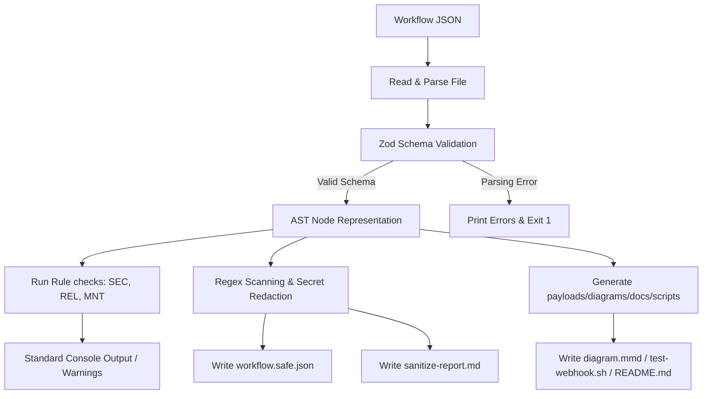

# FlowForge n8n - Architecture Design

This document details the architectural layout, package organization, and data pipeline of FlowForge n8n.

---

## 1. Package File Tree & Modules

The package `@flowforge-n8n/cli` is structured as follows:

```text
flowforge-n8n/
├── .claude-plugin/            # Claude Code extension specifications
│   └── plugin.json
├── commands/                  # Markdown files directing Claude Code CLI executions
│   ├── flow-new.md
│   ├── flow-validate.md
│   ├── flow-lint.md
│   └── ...
├── skills/                    # Specialized AI SOP directives
│   ├── n8n-workflow-engineer/
│   │   ├── SKILL.md
│   │   └── references/
│   ├── n8n-custom-node-builder/
│   └── n8n-workflow-debugger/
├── agents/                    # LLM System Prompts
│   ├── workflow-architect.md
│   ├── workflow-reviewer.md
│   ├── workflow-security-auditor.md
│   └── custom-node-engineer.md
├── hooks/                     # Editor integration triggers
│   └── hooks.json
├── src/                       # Core TypeScript codebase
│   ├── cli.ts                 # CLI entry point (Commander)
│   ├── index.ts               # Core API exports
│   ├── commands/              # CLI action wrappers (new, validate, etc.)
│   ├── core/                  # Engine logic
│   │   ├── workflowSchema.ts       # Zod models
│   │   ├── workflowValidator.ts    # JSON validator
│   │   ├── workflowLinter.ts       # Best practice scanner
│   │   ├── workflowSanitizer.ts    # Secret redactor
│   │   ├── payloadGenerator.ts     # Mock testing data builder
│   │   ├── webhookTestGenerator.ts # Trigger shell scripts builder
│   │   ├── diagramGenerator.ts     # Mermaid diagram exporter
│   │   ├── docsGenerator.ts        # Markdown docs generation
│   │   ├── workflowExplainer.ts    # Path analyzer
│   │   ├── workflowScorer.ts       # Metric scorecard generator
│   │   └── workflowDiff.ts         # AST differentiator
│   └── custom-node/           # n8n community node scaffolder
│       ├── customNodeGenerator.ts
│       └── templates/              # File templates (package.json, credentials, etc.)
```

---

## 2. Core Execution Pipeline

The execution flow for analysis commands is strictly local and runs sequentially:



### 2.1 Schema Mapping
The engine maps nodes to identify:
1.  **Nodes Directory:** Indexed map of nodes by `name` or `id` to quickly resolve connection source/target nodes.
2.  **Connections Adjacency Matrix:** A directed graph mapping which node output socket flows to which node input socket.

### 2.2 Template & Scaffolder Engine
The scaffolding engines read properties and output text templates:
*   **Custom Node Generator:** Utilizes TypeScript string templates representing `package.json`, `.node.ts` structures, and `.credentials.ts` structures, substituting the target auth, resource, and operations lists.
*   **Workflows Template System:** Loads predefined JSON files, sample payloads, and script layouts from the `templates/` folder and writes them to the specified output directory.
