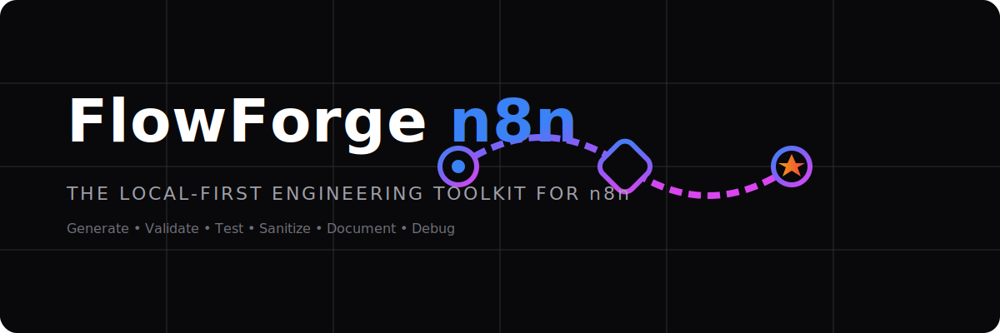

# FlowForge n8n

<p align="center">
  
</p>

<p align="center">
  <!-- Truthful Badges (No npm badge until published) -->
  <a href="https://github.com/mOHAD44DSFASF/flowforge-n8n/actions/workflows/ci.yml"></a>
  <a href="LICENSE"></a>
  <a href="https://nodejs.org"></a>
  <a href="https://typescriptlang.org"></a>
  <a href="https://n8n.io"></a>
  <a href="https://code.claude.com"></a>
</p>

**FlowForge n8n** is a local-first assurance layer for n8n workflow JSON: deterministic validation against bundled node metadata, static security/reliability/cost analysis, regression testing, snapshots, self-healing, semantic review, offline CI, and MCP tools.

---

## 🚀 The Flow
```text
Generate in n8n or n8n-mcp → validate → analyze → test → heal → review → offline CI
```

---

## 🔍 What is FlowForge n8n?

FlowForge n8n helps automation engineers and Claude Code users turn existing n8n workflows into review-ready, CI-ready artifacts. It does not compete with n8n-mcp on exhaustive node search or generation; use n8n-mcp to build workflows and FlowForge to prove they are structurally valid, semantically plausible, tested, sanitized, and safe to review.

---

## 🛑 What it is NOT
*   **Not a replacement for n8n:** FlowForge does not run or host n8n integrations. You edit and run workflows inside your active n8n instance.
*   **Not guaranteed production automation:** Generated workflows represent review-ready scaffolds. You must test and configure integrations before running them in production.
*   **Not a complete n8n runtime clone:** FlowForge simulates deterministic core nodes for regression tests and requires mocks for unsupported nodes.
*   **Not a hosted SaaS:** FlowForge operates entirely locally on your machine.
*   **Not an API key collector:** FlowForge does not request, log, or transmit your credentials.

---

## 🛠️ Features Summary

| Component | Description |
| :--- | :--- |
| **Workflow Scaffold Generator** | Creates connection blocks and JSON schemas from prompt parameters. |
| **Template Generator** | Installs 20 preconfigured automation workflow directories. |
| **Validator** | Asserts Zod schema compliance, catches duplicates, checks connection tracks, and runs bundled catalog semantic checks. |
| **Linter / Analyzer** | Audits retry configuration, naming, security, reliability, and cost risks with fail gates. |
| **Sanitizer** | Recursively scrubs GitHub, Stripe, and Slack keys. |
| **Payload Generator** | Generates mock payloads (valid, invalid, boundary cases) for simulation. |
| **Regression Test Runner** | Runs deterministic `*.flowforge.test.json` workflow simulations with mocks and snapshots. |
| **Self-Healing Loop** | Applies deterministic safe fixes from validation and analysis findings with an audit report. |
| **MCP Server** | Exposes validation, analysis, tests, diff, heal, sanitize, and payload tools over MCP. |
| **Git Review / CI / Eval** | Produces semantic review reports, deterministic AI evals, and offline CI results. |
| **Webhook Test Generator** | Compiles curl execution scripts (`test-webhook.sh`) for active webhook triggers. |
| **Mermaid Diagram Generator** | Translates workflow JSON layout files to Mermaid diagrams. |
| **Docs Generator** | Documents node specifications and credentials requirements. |
| **Explain Command** | Traces logic tracks in plain language. |
| **Quality Score** | Grades workflows (0-100) on reliability, security, and maintainability. |
| **Diff Command** | Lists added/removed nodes and edited parameters between files. |
| **Custom Node Generator** | Scaffolds node directories conforming to `n8n-nodes-starter` specs. |
| **Claude Code Plugin** | Provides slash commands, skills SOP manuals, system agents, and save hooks. |

---

## ⚡️ 60-Second CLI Quickstart

Since FlowForge n8n is in local distribution, clone and compile it inside your workspace:

```bash
# 1. Clone and compile
git clone https://github.com/mOHAD44DSFASF/flowforge-n8n.git
cd flowforge-n8n
pnpm install
pnpm build
pnpm flowforge --help

# 2. Generate review-ready workflow scaffold
pnpm flowforge new "Receive a lead from a webhook, validate it, call a CRM API, notify Slack, and respond with JSON" --out examples/generated/lead

# 3. Validate JSON structure, connections, and bundled catalog semantics
pnpm flowforge validate examples/generated/lead/lead.json

# 4. Analyze security, reliability, and cost risks
pnpm flowforge analyze examples/generated/lead/lead.json --json

# 5. Run deterministic regression tests
pnpm flowforge test "examples/generated/lead/*.flowforge.test.json" --reporter json

# 6. Apply deterministic safe fixes
pnpm flowforge heal examples/generated/lead/lead.json --dry-run

# 7. Review a workflow revision
pnpm flowforge review old.json new.json --out flowforge-review.md

# 8. Run offline CI
FLOWFORGE_OFFLINE=1 pnpm flowforge ci .

# 9. Redact private credentials before sharing
pnpm flowforge sanitize examples/generated/lead/lead.json
```

---

## 🤖 Use FlowForge inside Claude Code

FlowForge includes a Claude Code plugin consisting of custom slash commands, skills instructions, subagent systems, and file check hooks.

### Local Loading
Launch Claude Code pointing to your local repository directory:
```bash
claude --plugin-dir .
```

### Available Slash Commands
Inside Claude Code, run:
*   `/flowforge-n8n:flow-new`: Generate workflow JSON scaffolds.
*   `/flowforge-n8n:flow-validate`: Validate workflow structural paths.
*   `/flowforge-n8n:flow-lint`: Audit design configurations.
*   `/flowforge-n8n:flow-sanitize`: Scrub credentials.
*   `/flowforge-n8n:flow-payload`: Output simulation payloads.
*   `/flowforge-n8n:flow-test-webhook`: Compile curl scripts.
*   `/flowforge-n8n:flow-diagram`: Generate connection flowcharts.
*   `/flowforge-n8n:flow-docs`: Build specifications markdown.
*   `/flowforge-n8n:flow-explain`: Explain logic tracks.
*   `/flowforge-n8n:flow-score`: Score quality metrics.
*   `/flowforge-n8n:flow-diff`: Diff workflow revisions.
*   `/flowforge-n8n:node-new`: Scaffold custom node code.

### Example Prompts
*   `/flowforge-n8n:flow-new Create a workflow that receives leads from a webhook, validates email, stores them in Google Sheets, notifies Slack, and responds with JSON.`
*   `/flowforge-n8n:flow-validate workflows/lead.workflow.json`
*   `/flowforge-n8n:flow-sanitize workflows/lead.workflow.json`
*   `/flowforge-n8n:flow-diagram workflows/lead.workflow.json`
*   `/flowforge-n8n:flow-docs workflows/lead.workflow.json`
*   `/flowforge-n8n:node-new Create a custom n8n node scaffold for a CRM API using API key authentication.`

---

## 🛒 Claude Code Marketplace Installation

After publishing your repository to GitHub, you can add it to your Claude Code marketplace and install it:

```text
/plugin marketplace add mOHAD44DSFASF/flowforge-n8n
/plugin install flowforge-n8n@flowforge-n8n
/reload-plugins
```

*Note: If the plugin commands do not appear, update Claude Code and run `/reload-plugins`. Ensure that the repository is public and contains `.claude-plugin/marketplace.json`.*

---

## CLI Command Reference

| Command | Purpose | Example |
| :--- | :--- | :--- |
| `new` | Scaffold workflow JSON from keywords or template copy. | `flowforge new --template lead-to-crm` |
| `validate` | Check schema format, duplicate names, connection tracks, and bundled node catalog semantics. | `flowforge validate workflows/lead.json --json` |
| `lint` | Audit retry settings, orphan nodes, naming, and static analysis findings. | `flowforge lint workflows/lead.json --fail-on warning` |
| `analyze` | Deep static analysis for security, reliability, cost, and maintainability. | `flowforge analyze workflows/lead.json --json` |
| `heal` | Apply deterministic fixes and emit `heal-report.json`. | `flowforge heal workflows/lead.json --max-iterations 5` |
| `mcp` | Start the MCP server over stdio or Streamable HTTP. | `flowforge mcp` |
| `review` | Review semantic changes and introduced findings. | `flowforge review old.json new.json --out review.md` |
| `eval` | Replay deterministic AI-agent eval recordings. | `flowforge eval "*.flowforge.eval.json" --reporter json` |
| `ci` | Run offline CI with JSON and JUnit reports. | `FLOWFORGE_OFFLINE=1 flowforge ci .` |
| `sanitize` | Redact Slack/Stripe keys and Authorization headers. | `flowforge sanitize workflows/lead.json` |
| `payload` | Output 6 simulation payload variants. | `flowforge payload lead-form` |
| `test` | Run deterministic workflow regression tests. | `flowforge test "tests/**/*.flowforge.test.json" --reporter json` |
| `test-webhook` | Generate mock webhook execution scripts. | `flowforge test-webhook workflows/lead.json` |
| `diagram` | Render layout graph as Mermaid flowchart files. | `flowforge diagram workflows/lead.json` |
| `docs` | Compile specs and credentials checklist. | `flowforge docs workflows/lead.json` |
| `explain` | Translate connection logic to plain English. | `flowforge explain workflows/lead.json` |
| `score` | Calculate structural metrics score (0-100). | `flowforge score workflows/lead.json` |
| `diff` | Analyze differences between two versions. | `flowforge diff old.json new.json` |
| `node-new` | Scaffold custom n8n community node directories. | `flowforge node-new CRMNode` |

---

## 📦 Included Workflow Templates

FlowForge ships with 20 preconfigured templates. Run `flowforge new --template <name>` to clone:

*   `lead-to-crm`: Webhook lead receiver and CRM integration.
*   `stripe-payment-alert`: Slack notifications for Stripe payment events.
*   `shopify-order-to-sheets`: Append Shopify orders to Google Sheets logs.
*   `webhook-router`: Route requests by event parameter.
*   `ai-email-triage`: AI triage classifier for incoming emails.
*   `support-ticket-classifier`: Categorize ticket sentiment.
*   `crm-enrichment`: Clearbit API data enrichment updates.
*   `invoice-processing`: Parse and route invoice metadata.
*   `rss-to-social`: Buffer feed updates to social channels.
*   `slack-approval-gate`: Trigger Slack approval response buttons.
*   `airtable-sync`: Schedule select DB records to Airtable.
*   `error-alerting`: Fallback catcher alert notify triggers.
*   `scheduled-report`: Stripe balance queries email reporter.
*   `form-to-email`: Form webhook email notification dispatch.
*   `google-sheets-dedup`: Check sheets rows for duplicates before inserting.
*   `ai-lead-qualification`: AI-based qualification evaluator alerts.
*   `webhook-to-postgres`: Webhook payload insertion directly to database.
*   `telegram-notifier`: Dispatch bot chat notifications.
*   `content-repurposing`: Split text to marketing drafts layouts.
*   `human-in-the-loop-ai`: AI classifications approved via Slack buttons.

> **Note on Assets:** Webhook-based templates include `test-webhook.sh`. Non-webhook templates include docs, diagrams, credentials checklist, and sample data where applicable.

---

## 🔒 Security Policy

*   **No credential collection:** FlowForge never asks for your real API keys or platform credentials.
*   **Placeholder setups:** Generated scaffolds write placeholder values (`**REDACTED_SECRET**` or `**CREDENTIAL_PLACEHOLDER**`) to parameters.
*   **Sanitization checker:** `sanitize` scans and redacts high-entropy keys locally before repository check-ins.
*   **Verification:** Always manually review workflow JSON layouts before staging. Never commit live keys or `.env` credential files.

---

## ⚠️ Limitations
*   `v0.2.0` operates offline by default and does not spin up a live n8n server runtime.
*   Workflows created are review-ready scaffolds; API connection authentication must be configured inside your n8n editor UI.
*   `node-new` scaffolds custom TS and package files. You must implement downstream API fetch calls yourself.

---

## 🗺️ Roadmap
*   **v0.2.0:** Assurance layer: semantic validation, static analysis, regression tests, self-healing, MCP, review, eval, and offline CI.
*   **v0.3.0:** OpenAPI imports, curl-to-workflow compilers, expression fixers, and log debugger.
*   **v1.0.0:** Stable execution compatibility checks and automated custom node code builders.

---

## 🤝 Contributing
Contributions are welcome! Please view our [Contributing Guidelines](CONTRIBUTING.md) to get started on open issues.

---

## 📄 License
FlowForge n8n is licensed under the [MIT License](LICENSE).
