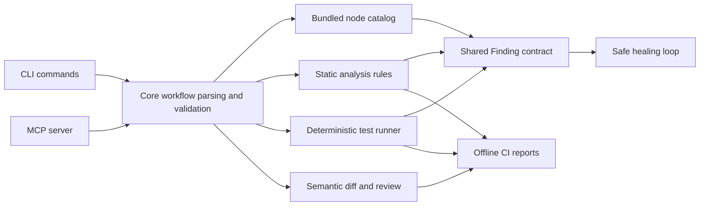

# FlowForge Assurance v2 Architecture

## Contracts

- Catalog: `CatalogNode`, `CatalogParameter`, `CatalogCredential`, `NodeCatalogSnapshot`.
- Workflows: `N8nWorkflowSchema`, parsed through `parseWorkflowFile` and `parseWorkflowString`.
- Findings: `Finding`, `FindingSeverity`, `FindingCategory`, and machine-actionable `FindingFix`.
- Testing: `FlowForgeTestFile`, `FlowForgeTestCase`, `TestRunResult`, and reporter-specific renderers.
- Healing: `HealReport`, `HealIteration`, `HealResult`, and deterministic fix appliers.
- CI/eval/review: JSON-first result objects with TTY/Markdown renderers where useful.

## Boundaries

- Offline by default: validation, analysis, tests, diff, eval replay, and CI do not need network access.
- Live mode is opt-in and guarded by `assertOnline`.
- MCP is an interface over the core modules, not a separate implementation.
- Healing writes only local copies unless `--write` is explicit; it never mutates a live n8n instance.
